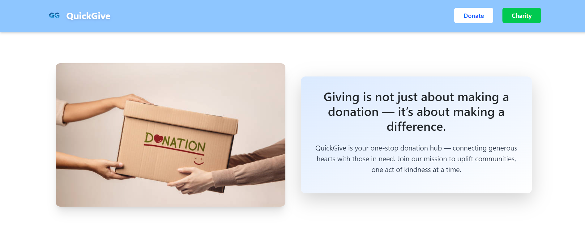
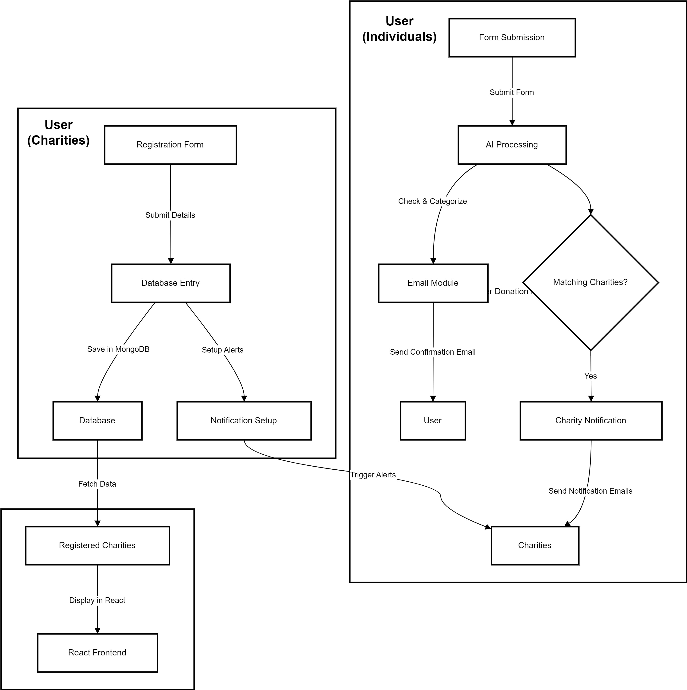

# **SmartDonationHub**

SmartDonationHub is a food charity service designed to help the process of food donations with **AI**. Individuals can easily donate food items, while registered charities can claim and distribute these donations efficiently. Powered by artificial intelligence, SmartDonationHub automatically filters donation entries through advanced features such as troll detection and donation category detection.

[Youtube Video Link (Click)](https://www.youtube.com/watch?v=O-hE_K3e0yQ)

---

## **Table of Contents**

- [About](#about)
- [Key Features](#key-features)
- [Architecture](#architecture)
- [Tech Stack](#tech-stack)
- [Challenges](#challenges)
- [Future Enhancements](#future-enhancements)

---

## **About**

SmartDonationHub aims to connect the gap between individuals who wish to donate excess food and charities in need of support. the platform helps ensure the quality of the donation data and prevents misuse.

---

## **Key Features**

- **User-Friendly Donation Process:**  
  Easily submit food donations via an intuitive form.

- **AI-Powered Filtering and Categorization:**

  - **Troll Detection:** Filters out inappropriate or non-genuine entries.
  - **Donation Category Detection:** Automatically categorizes donated items for streamlined processing.

- **Charity Registration & Notification:**  
  Charities can register, and if a new donation matches their registered category, they receive email notifications.

- **Automated Email Confirmation:**  
  Donors receive a confirmation email when their donation is accepted.

- **Frontend Display of Registered Charities:**  
  A user-friendly interface shows all registered charities.

---

## **Architecture**

SmartDonationHub’s architecture is designed to handle both donation and charity registration workflows. It integrates AI-based filtering, email notifications, and database operations.

### **Data Flow Overview**

1. **User Donation Process**

   - **Form Submission:**  
     Users fill out a donation form on the frontend.
   - **AI Processing:**  
     The backend processes the submission through an AI module that checks for troll inputs and categorizes the donation.
   - **Email:**
     - A confirmation email is sent to the donor.
   - **Charity Notification:**  
     The system identifies matching charities (based on category) and sends them notification emails.

2. **Charity Registration Process**

   - **Registration Form:**  
     Charities submit their details via the frontend.
   - **Database Entry:**  
     The backend saves charity details in MongoDB.
   - **Notification Setup:**  
     Once registered, charities automatically receive alerts when a relevant donation is made.

3. **Frontend Display**
   - **Registered Charities:**  
     The React frontend displays a list of registered charities by fetching data from the database.

---

## **Tech Stack**

### **Deployment**

- **Vercel:**  
  Serverless platform hosting both frontend and backend services.

### **Backend**

- **Node.js & JavaScript:**  
  Powers the API endpoints and server-side logic.
- **Gemini AI:**  
  Provides enhanced donation filtering and categorization.

### **Frontend**

- **React:**  
  Creates a dynamic and engaging user interface.

### **Database**

- **MongoDB:**  
  A NoSQL database used for storing charity data.

---

## **Challenges**

### **Serverless Environment**

- Managing database connections and cold starts on Vercel’s free tier.

### **AI Integration**

- Ensuring real-time processing for troll detection and accurate donation categorization without significant latency.

### **Notification Management**

- Coordinating email notifications between donors and charities based on donation categories.

## **Future Enhancements**

### **Serverless Environment**

- to keep database connections, it needs to use a paid tier to avoid DB connection inactivity on Vercel’s free tier.
